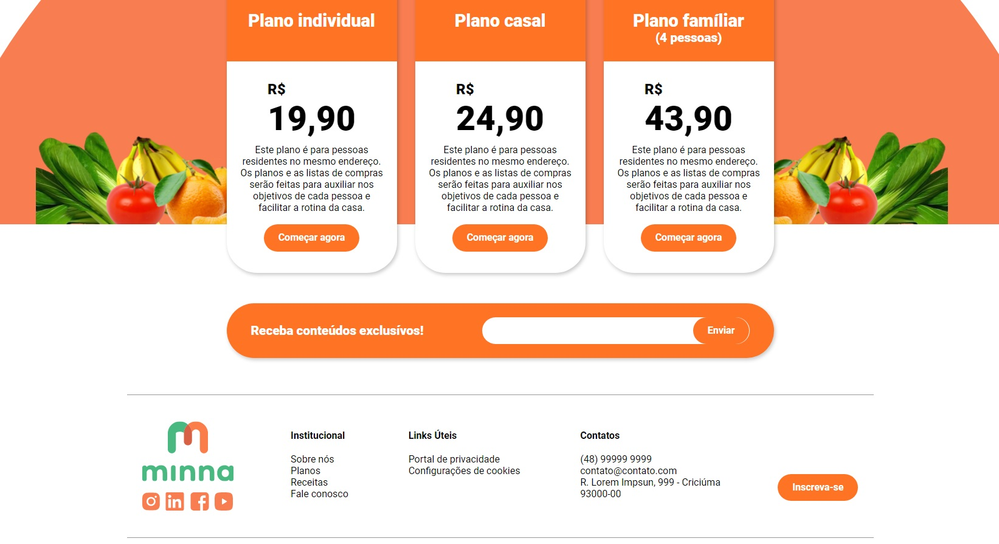

<h1 align="center">Nutri Alimentação - Minna</h1>




> Site de nutrição.

## :page_facing_up: Explicação

O projeto foi desenvolvido utilizando a biblioteca [ReactJS](https://pt-br.reactjs.org/docs/getting-started.html)

## 🚀 Tecnologias ##

- [ReactJS](https://pt-br.reactjs.org/)
- [TypeScript](https://www.typescriptlang.org/)

## :closed_book: Como usar? ##

Antes de iniciar, você precisa ter [Git](https://git-scm.com) e [Node](https://nodejs.org/en/) instalados.

```bash
# Clone this project
$ git clone https://github.com/antonio-ma-santos/desafio-front-cloudopss.git
# Access
$ cd desafio-front-cloudopss
# Install dependencies
$ yarn or npm install
# Run the project
$ yarn dev or npm run dev 
# The server will initialize in the <http://localhost:5173>
```
